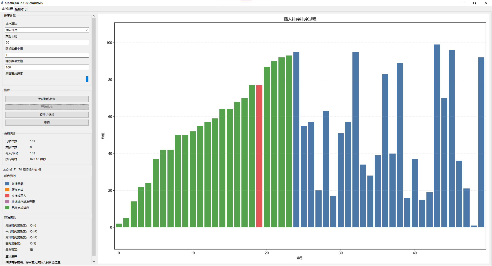
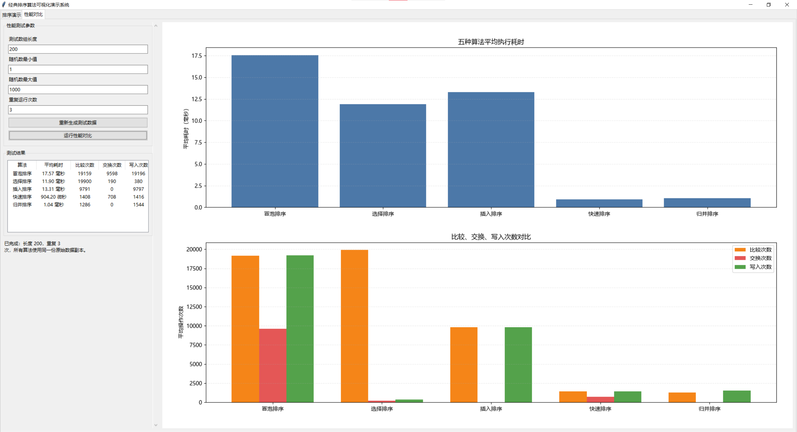

# 经典排序算法可视化演示系统

这是一个使用 Python、Tkinter 和 Matplotlib 实现的桌面程序，用来动态展示经典排序算法的执行过程，并对不同算法做简单的性能对比。

程序包含两个页面：

- `排序演示`：播放排序动画，查看当前步骤和统计数据。
- `性能对比`：用同一组测试数据比较五种算法的平均耗时和操作次数。

## 界面展示

### 排序演示



### 性能对比



## 支持的排序算法

当前支持五种算法：

- 冒泡排序
- 选择排序
- 插入排序
- 快速排序
- 归并排序

这些算法都定义在 `algorithms.py` 中，界面代码不会重新实现排序逻辑。

## 主要功能

### 排序演示

在“排序演示”页面可以：

- 设置数组长度和随机数范围。
- 生成随机数组。
- 选择排序算法。
- 调整动画播放速度。
- 开始排序动画。
- 暂停和继续动画。
- 重置为本次排序开始前的数组。
- 查看当前排序步骤说明。
- 查看比较次数、交换次数、写入 / 移动次数和执行耗时。
- 查看算法的最好、平均、最坏时间复杂度，空间复杂度，稳定性和基本原理。

右侧柱状图中，每根柱子表示一个数组元素，柱子高度表示元素数值。颜色含义如下：

| 颜色 | 含义 |
| --- | --- |
| 蓝色 | 普通元素 |
| 橙色 | 正在比较 |
| 红色 | 交换或写入 |
| 紫色 | 快速排序的基准元素 |
| 绿色 | 已经完成排序 |

### 性能对比

在“性能对比”页面可以：

- 设置测试数组长度和随机数范围。
- 设置重复运行次数。
- 重新生成测试数据。
- 运行五种算法的性能对比。

性能测试会让五种算法使用相同原始数据的副本，避免前一个算法修改后影响后一个算法。结果会显示：

- 平均耗时。
- 平均比较次数。
- 平均交换次数。
- 平均写入次数。

结果同时通过左侧表格和右侧柱状图展示。性能测试调用排序函数时不生成动画步骤，避免动画绘制影响耗时统计。

## 项目结构

当前项目核心文件如下：

```text
sorting-algorithm-visualizer/
├── algorithms.py
├── app.py
├── README.md
├── .gitignore
└── LICENSE
```

文件职责：

- `algorithms.py`：负责五种排序算法、排序统计数据、动画步骤数据和算法复杂度信息。
- `app.py`：负责 Tkinter 桌面界面、动画播放、Matplotlib 图表绘制、输入检查和性能对比。

## 设计说明

排序函数通过 `SortStep` 向界面提供动画帧。每一步包含数组副本、正在比较的位置、交换或写入的位置、已排序位置、快速排序的基准元素位置、文字说明和当前统计数据。

界面读取这些步骤后，用 Tkinter 的定时刷新机制逐帧更新 Matplotlib 柱状图。暂停时不会推进步骤索引，继续时从当前位置恢复播放。

性能对比页面复用同一组排序函数，但调用时不传入动画回调，因此不会生成动画帧，只统计排序结果和操作次数。

## 运行环境

当前项目实际使用环境：

- Python 3.13.7
- Tkinter 8.6
- Matplotlib 3.11.0

Tkinter 通常随 Python 一起安装。如果启动时提示 Tcl/Tk 相关错误，需要检查当前 Python 安装中的 Tcl/Tk 组件是否完整。

安装 Matplotlib：

```bash
pip install matplotlib
```

启动程序：

```bash
python app.py
```

## 许可证

本项目使用 MIT License，详见 `LICENSE`。
